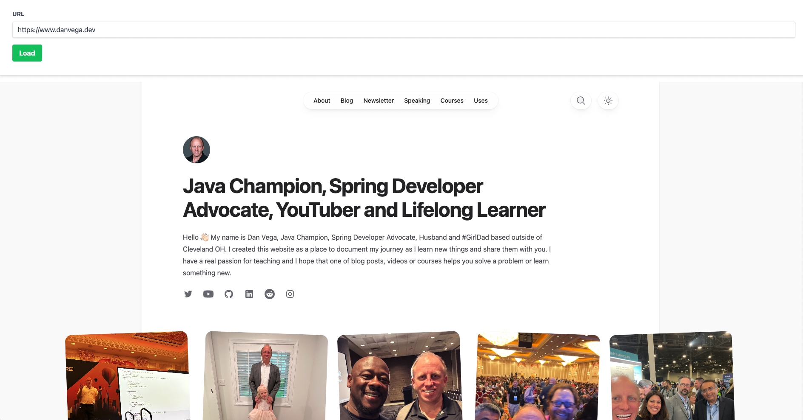
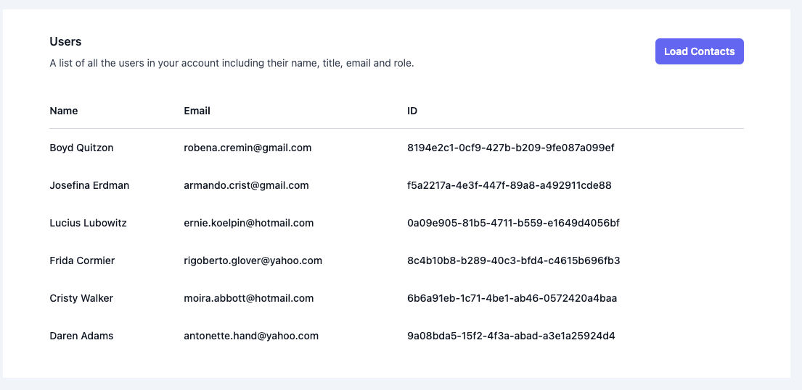
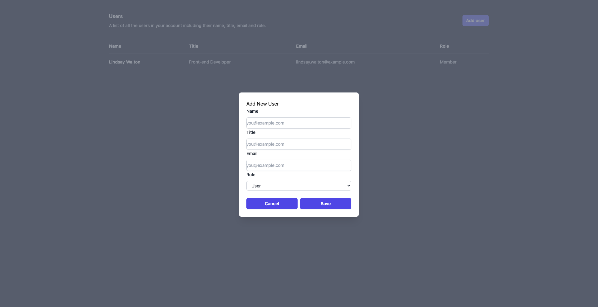

# Hello htmx

A collection of samples of what you can do with Spring Boot + Thymeleaf + htmx.

## 01 Load Banner

This is a basic example of covering some of the core attributes in htmx. In this demo the page will load and return to
you an empty banner with a button. When you click the button you will make a call to the server and just get the text
to replace the banner. This covers the following concepts

- `hx-get`
- `hx-target`
- `hx-swap`
- Working with fragments in Thymeleaf

## 02 - Load a website dynamically without leaving the page

- WebsiteLoaderController
- takes a url from a form and will dynamically return an iframe with that url
- website.html fragment returns iframe

## 03 Load More Contacts

This example demonstrates how to load more contacts using htmx. The initial page loads returns the `01/index.html`
 view which contains the first 3 contacts. When you click the load contacts button a call is made to the `_01/ContactsController` 
to request the next 3 contacts. The response is then inserted into the DOM using htmx.

## 04 - Add new Contact (Coming Soon!)

This example demonstrates how to add a new contact using htmx. The initial page loads returns the `02/index.html`
 view which contains the initial list of users. When you click on the add user button a modal window will open with a form
allowing you to add a new user.

## Notes

I am using Tailwind CSS for styling and including the CDN. This is not something I would suggest doing in 